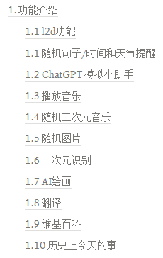
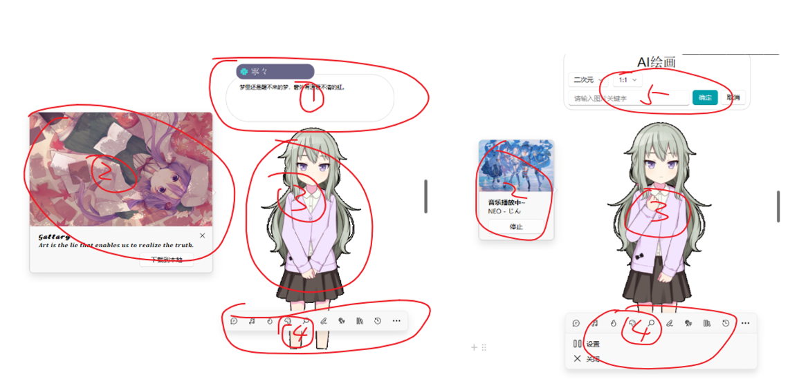
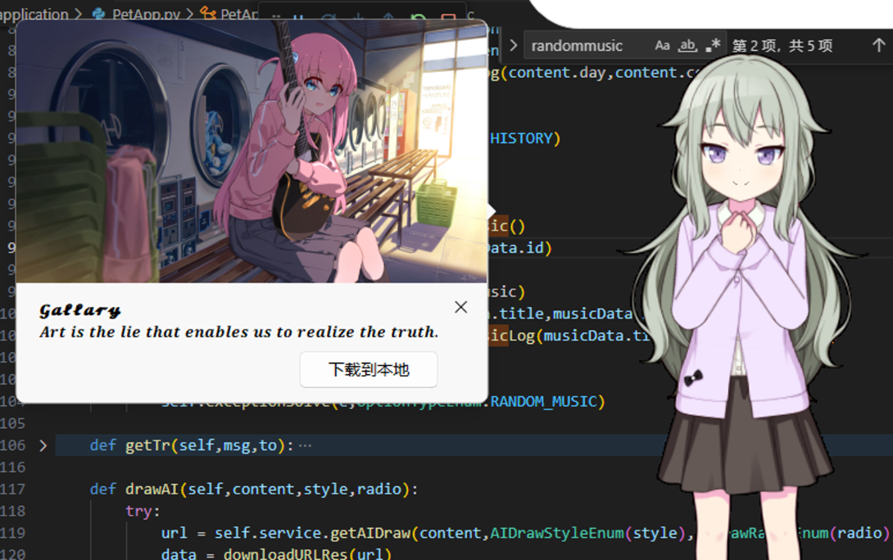

  

 🥕 

 如果兔兔的仓库对你有帮助的话点个⭐喵~ 

 If Tutu's repository is helpful to you, please give it a ⭐ meow~ 

 もしうさぎのリポジトリが役に立った場合は、⭐をぽちっとしてくださいにゃん~  

 🍉 

 任何 ❓问题/💭思考/💡想法 都欢迎提出！

 Any ❓question/💭thought/💡idea  is welcome! 

 どんな ❓質問/💭考え/💡アイデア でも歓迎です！ 

# 简介

本仓库为同济大学软件学院 2023 秋微服务架构课程个人项目：Programming with Web APIs

作业要求 & 作业笔记 & 其他事项见链接：🔗 [Review](https://momoyamasawa.notion.site/bf2c83d5b0dd4c92bbde009b307eca97?pvs=4)

设计和实现报告：🔗 [设计和实现报告](https://momoyamasawa.notion.site/c9e14d81e72840f9a227fd5c3aeecd73?pvs=4)

配置和部署报告：🔗 [配置和部署报告](https://momoyamasawa.notion.site/d2b336f3086a47b19f450fe0ec6be2ca?pvs=4)

